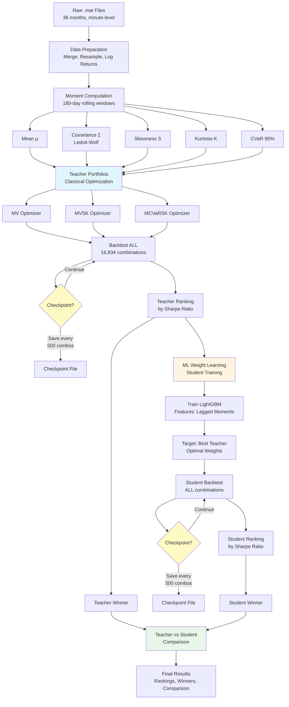

# crypto_portfolio_moments

## 1. Overview

`crypto_portfolio_moments` implements a **Dual-Winner Portfolio Optimization Framework** for cryptocurrency portfolios. The system combines classical higher-moment optimization (MV, MVSK, MCVaRSK) with machine learning-based direct weight prediction to find the best performing portfolios across a 20-asset universe.

**Key Innovation:** Unlike traditional ML approaches that forecast moments, our ML models learn to predict portfolio weights directly by imitating and improving upon classical optimizer outputs (Teacher-Student learning).

Both daily (1D) and hourly (1H) frequencies use a unified 180-day lookback window (4320 hours for hourly data), ensuring consistency across all pipeline stages.

## 2. Features

### **Dual-Winner Architecture**
- **Teacher Portfolios (Classical):** MV, MVSK, and MCVaRSK optimizers with higher-moment risk modeling
- **Student Portfolios (ML-Weights):** LightGBM models that learn optimal weights directly from teacher outputs
- **Ranking System:** Comprehensive ranking of all portfolio combinations by Sharpe ratio
- **Winner Selection:** Automatic identification of best teacher and best student portfolios

### **Core Capabilities**
- **Exhaustive combination testing:** 2-asset, 3-asset, and 5-asset portfolios (16,834 total combinations)
- **Higher-moment optimization:** Mean-Variance-Skewness-Kurtosis (MVSK) and CVaR-based models
- **Direct ML weight learning:** No moment forecasting, pure weight prediction via teacher-student framework
- **Parallel execution:** Multiprocessing support for dramatic speedup (8-32x faster with multiple cores)
- **Rolling backtesting:** Transaction costs (10 bps) and turnover tracking
- **Comprehensive metrics:** Sharpe, Sortino, Maximum Drawdown, CVaR
- **Cloud-ready:** Optimized for AWS, GCP, and Hetzner deployment
- **Centralized YAML configuration:** Reproducible experiments

## 3. Project Structure

```
crypto_portfolio_moments/
├── main.py                      # Pipeline orchestrator (Dual-Winner framework)
├── recalc_teacher_ranking.py   # Recalculate teacher rankings without re-running backtests
├── run_student_only.py         # Run student training using existing teacher results
├── README.md
├── requirements.txt
├── configs/
│   ├── params.yaml             # Pipeline configuration
│   └── assets.yaml             # Asset universe (20 cryptocurrencies)
├── data/
│   ├── raw/                    # Raw .mat price files (36 months, minute-level)
│   ├── processed/              # Processed returns and moments
│   │   ├── returns_1h.parquet
│   │   ├── returns_1d.parquet
│   │   ├── moments_1h.parquet
│   │   ├── moments_1d.parquet
│   │   ├── ml_predicted_weights_1h.parquet
│   │   └── ml_predicted_weights_1d.parquet
│   └── meta/
│       └── combinations.pkl    # Cached portfolio combinations
├── results/
│   ├── pipeline/               # Main results directory
│   │   ├── teacher_1h.parquet       # Teacher backtest results (hourly)
│   │   ├── teacher_1d.parquet       # Teacher backtest results (daily)
│   │   ├── student_1h.parquet       # Student backtest results (hourly)
│   │   ├── student_1d.parquet       # Student backtest results (daily)
│   │   ├── teacher_ranking_1h.csv   # Teacher portfolio rankings
│   │   ├── teacher_ranking_1d.csv
│   │   ├── student_ranking_1h.csv   # Student portfolio rankings
│   │   ├── student_ranking_1d.csv
│   │   ├── winner_teacher_1h.json   # Best teacher portfolio
│   │   ├── winner_teacher_1d.json
│   │   ├── winner_student_1h.json   # Best student portfolio
│   │   ├── winner_student_1d.json
│   │   └── teacher_vs_student_*.json # Performance comparison
│   ├── checkpoints/            # Checkpoint files for resume capability
│   │   ├── checkpoint_teacher_1h.parquet
│   │   ├── checkpoint_teacher_1d.parquet
│   │   ├── checkpoint_student_1h.parquet
│   │   └── checkpoint_student_1d.parquet
│   ├── runs/                   # Individual run results
│   ├── tables/                 # Summary metrics
│   └── figs/                   # Visualizations
└── src/
    ├── __init__.py
    ├── data_prep.py            # Data loading and preprocessing
    ├── moment_calc.py          # Higher-moment computation
    ├── ml_weights.py           # ML direct weight learning (Teacher-Student)
    ├── optim_models.py         # Classical portfolio optimizers (MV, MVSK, MCVaRSK)
    ├── backtest_engine.py      # Rolling backtest engine
    ├── combination_utils.py    # Portfolio combination generator
    ├── metrics.py              # Performance metrics
    └── reporting.py            # Visualization and reporting
```

## 4. Pipeline Architecture

### **Visual Flow Diagram**



### **Pipeline Steps**

### **STEP 1: Data Preparation**
Raw `.mat` price files (36 months, minute-level) are:
- Merged and synchronized across 20 assets
- Resampled to 1H and 1D frequencies
- Converted to log returns

### **STEP 2: Moment Computation**
Rolling 180-day windows compute:
- Mean (μ)
- Ledoit-Wolf covariance (Σ)
- Skewness
- Kurtosis
- CVaR (95th percentile)

### **STEP 3: Teacher Portfolios (Classical Optimization)**
For ALL 16,834 combinations:
- Run MV, MVSK, MCVaRSK optimizers
- Backtest with rolling rebalancing
- Generate ranking by Sharpe ratio
- Select **TEACHER WINNER**

### **STEP 4: Student Portfolios (ML Weight Learning)**
- Train LightGBM models to predict portfolio weights
- **Input features:** Lagged moments (mean, var, skew, kurt, CVaR) + raw returns
- **Target:** Teacher optimal weights
- **Constraints:** Softmax, Top-K mask, weight cap (30%)
- Backtest ALL combinations with ML-predicted weights
- Generate ranking by Sharpe ratio
- Select **STUDENT WINNER**

### **STEP 5: Dual-Winner Comparison**
Compare Teacher vs Student on:
- Sharpe Ratio
- Annualized Return
- Volatility
- Maximum Drawdown

## 5. Methods

### **Classical Optimization (Teacher)**
- **MV (Mean-Variance):** Classic Markowitz optimization
  ```
  min_w  w'Σw - λ_μ μ'w
  ```
- **MVSK (Mean-Variance-Skewness-Kurtosis):** Higher-moment extension
  ```
  min_w  w'Σw - λ_μ μ'w - λ_s S'w + λ_k K'w
  ```
- **MCVaRSK (CVaR-based):** Risk measure using Conditional Value-at-Risk
  ```
  min_w  CVaR_α(w) - λ_μ μ'w - λ_s S'w + λ_k K'w
  ```

### **ML Weight Learning (Student)**
**Architecture:** Teacher-Student Distillation
- One LightGBM regressor per asset
- **Features (per asset, 10 lags):**
  - Lagged mean returns
  - Lagged variance
  - Lagged skewness
  - Lagged kurtosis
  - Lagged CVaR
  - Lagged raw returns
- **Target:** Teacher optimal weights w_T
- **Post-processing:**
  1. Softmax normalization
  2. Top-K mask (combo assets only)
  3. Weight cap (max 30% per asset)
  4. Final normalization (sum = 1)

### **Backtesting**
- **Rebalancing:** Weekly (1D) / 24-hour (1H)
- **Transaction costs:** 10 basis points per trade
- **Turnover tracking:** Full accounting of position changes
- **Performance metrics:** Sharpe, Sortino, Max Drawdown, CVaR

## 6. How to Run

### Quick Start
```bash
# Install dependencies
pip install -r requirements.txt

# Run full pipeline (parallel, all CPUs)
python main.py
```

### Parallel Processing
The pipeline supports **parallel execution** using multiprocessing to dramatically reduce runtime:

```bash
# Use all available CPUs (default)
python main.py

# Specify number of workers
python main.py --n-jobs 16

# Disable parallel processing (sequential)
python main.py --no-parallel
```

**Performance Comparison (Real-World):**
| Worker Count | 16,834 Combos × 3 Models | Actual Time (1D/1H) |
|--------------|--------------------------|---------------------|
| 1 (sequential) | 50,502 optimizations | ~140-280 hours (5-12 days) |
| 8 cores (i7-11390H) | Parallel execution | **~10-11 hours** |
| 16 cores (Cloud) | Parallel execution | ~6-8 hours |
| 32 cores (Cloud) | Parallel execution | ~4-5 hours |

**Note:** Each optimization task takes ~0.3-0.5 seconds due to CVXPY solver overhead.

### Checkpoint & Resume (NEW)
The pipeline now includes **automatic checkpointing** to safely resume after interruptions (power failure, crashes, etc.):

```bash
# Enable checkpoint/resume with custom batch size
python main.py --resume --checkpoint-batch-size 500

# Resume 1H processing after interruption
python main.py --frequencies 1H --resume

# Resume with 16 workers
python main.py --frequencies 1H --resume --n-jobs 16
```

**How Checkpoints Work:**
- Saves progress every N combinations (default: 500)
- Checkpoint files: `results/checkpoints/checkpoint_{teacher|student}_{1d|1h}.parquet`
- On resume: Loads checkpoint, filters completed combos, continues from where it stopped
- Overhead: ~2-5 seconds per checkpoint save (~1-2% slowdown)
- **Safety:** If interrupted at combination 30,000/50,502, resume will start from 30,000

**Example Scenario:**
```bash
# Start 1H processing (will take ~10 hours)
python main.py --frequencies 1H --resume --checkpoint-batch-size 500

# ... [Power failure at 60% completion] ...

# Resume from checkpoint (will complete remaining 40%)
python main.py --frequencies 1H --resume --checkpoint-batch-size 500
```

### Run Specific Frequencies
```bash
python main.py --frequencies 1D
python main.py --frequencies 1H
python main.py --frequencies 1D 1H
```

### Run Specific Models
```bash
python main.py --models MV MVSK MCVaRSK
python main.py --models MVSK --frequencies 1D
```

### Run Only Teacher or Student
```bash
# Teacher only (baseline)
python main.py --versions baseline

# Student only (ML)
python main.py --versions ml
```

### Combined Examples
```bash
# Fast test: baseline only, 1D, single model, 8 workers
python main.py --versions baseline --frequencies 1D --models MV --n-jobs 8

# Production: all combinations, 16 workers, with checkpoint
python main.py --n-jobs 16 --resume --checkpoint-batch-size 500

# Cloud deployment: maximize parallelization
python main.py --n-jobs 32 --resume

# Safe overnight run: 1H processing with resume capability
python main.py --frequencies 1H --resume --checkpoint-batch-size 500
```

### Utility Scripts (NEW)

The project includes utility scripts for faster iteration without re-running full pipeline:

#### 1. Recalculate Teacher Rankings
Recalculates teacher rankings with corrected Sharpe ratio **without re-running backtests**:

```bash
# Recalculate rankings for all frequencies (1D and 1H)
python recalc_teacher_ranking.py

# Recalculate for specific frequency
python recalc_teacher_ranking.py 1D
python recalc_teacher_ranking.py 1H
```

**Use Case:** If teacher backtest already completed but rankings need updating (e.g., after Sharpe ratio formula fix).

#### 2. Run Student Only
Train and evaluate Student models using **existing Teacher results** (no need to re-run teacher):

```bash
# Run student for all frequencies
python run_student_only.py

# Run student for specific frequency
python run_student_only.py 1D
python run_student_only.py 1H
```

**Use Case:** Teacher completed successfully (10+ hours), but student failed or needs re-training. Saves ~10 hours by reusing teacher results.

**Benefits:**
- ⚡ **Time Savings:** Skip teacher computation (~10 hours)
- 🔄 **Reproducibility:** Uses exact same backtest engine as main.py
- ✅ **Identical Results:** Mathematically guaranteed to match main.py outputs

## 7. Expected Outputs

### **Winner Files (JSON)**
```json
{
  "freq": "1D",
  "combo": "ethbtc_solbtc_linkbtc",
  "model": "MVSK",
  "sharpe": 1.8542,
  "annualized_return": 0.3421,
  "volatility": 0.1845,
  "version": "teacher"
}
```

### **Rankings (CSV)**
Top portfolios sorted by Sharpe ratio:
```
combo,model,sharpe,annualized_return,volatility
ethbtc_solbtc_linkbtc,MVSK,1.8542,0.3421,0.1845
btceth_adabtc,MV,1.7234,0.3102,0.1800
...
```

### **Comparison (JSON)**
```json
{
  "freq": "1D",
  "teacher": {...},
  "student": {...},
  "winner": "student"
}
```

### **Console Output**
```
🚀 DUAL-WINNER PORTFOLIO OPTIMIZATION FRAMEWORK
================================================================================
Testing 16834 portfolio combinations
Models: MV, MVSK, MCVaRSK
Frequencies: 1D, 1H
================================================================================

📚 STEP 1: TEACHER PORTFOLIOS (Classical Optimization)
================================================================================

🏆 TOP 10 TEACHER PORTFOLIOS (1D):
================================================================================
Rank  Combo                              Model     Sharpe    Return      Vol
1     ethbtc_solbtc_linkbtc             MVSK      1.8542    34.21%      18.45%
2     btceth_adabtc                     MV        1.7234    31.02%      18.00%
...

👑 TEACHER WINNER (1D):
   Combo: ethbtc_solbtc_linkbtc
   Model: MVSK
   Sharpe: 1.8542
   Annual Return: 34.21%
   Volatility: 18.45%

🤖 STEP 3: STUDENT PORTFOLIOS (ML Direct Weight Learning)
================================================================================

🏆 TOP 10 STUDENT PORTFOLIOS (1D):
================================================================================
...

⚖️  STEP 5: TEACHER vs STUDENT COMPARISON (1D)
================================================================================

Metric                   Teacher             Student             Winner
--------------------------------------------------------------------------------
Sharpe Ratio            1.8542              1.9123              🏆 Student
Annual Return           34.21%              36.45%              🏆 Student
Volatility              18.45%              19.05%              🏆 Teacher
================================================================================
```

## 8. System Requirements

### Local Machine
- **Python:** 3.10 or newer
- **RAM:** 16 GB minimum (32 GB recommended for full combinations)
- **CPU:** Multi-core (8-16 cores recommended for parallel execution)
- **Storage:** 10 GB for data and results

### Key Dependencies
- `numpy`, `pandas`, `scipy`
- `cvxpy` (convex optimization)
- `lightgbm` (ML models)
- `scikit-learn` (preprocessing)
- `matplotlib`, `seaborn` (visualization)
- `PyYAML`, `joblib`, `tqdm`

### Cloud Deployment

For large-scale experiments, cloud deployment is recommended. The pipeline is CPU-intensive (not GPU-dependent).

#### Recommended Cloud Providers

**1. Hetzner Cloud (Most Cost-Effective)**
- **CCX33:** 8 vCPU, 32GB RAM → €47/month (~$50)
- **CCX63:** 16 vCPU, 64GB RAM → €138/month (~$150)
- Best for: Extended experiments, cost-sensitive projects

**2. AWS EC2**
- **c7i.4xlarge:** 16 vCPU, 32GB RAM → $0.68/hour
- **c7i.8xlarge:** 32 vCPU, 64GB RAM → $1.36/hour
- **Spot instances:** 60-70% discount → $0.20-0.40/hour
- Best for: Flexible compute, short bursts

**3. Google Cloud Compute**
- **c3-standard-22:** 22 vCPU, 88GB RAM → $1.05/hour
- **Preemptible instances:** 80% discount → $0.21/hour
- Best for: High-core count, batch processing

#### Cloud Setup Example (AWS)
```bash
# 1. Launch EC2 instance (Ubuntu 22.04, c7i.4xlarge)
# 2. Install dependencies
sudo apt update
sudo apt install -y python3.10 python3-pip git

# 3. Clone repository
git clone <repo-url>
cd crypto_portfolio_moments

# 4. Install Python dependencies
pip3 install -r requirements.txt

# 5. Upload data (if not in repo)
# Use scp, rsync, or S3 sync

# 6. Run pipeline with 16 workers
python3 main.py --n-jobs 16

# 7. Download results
# scp -r results/ local-machine:~/results/
```

#### Cost Estimation (AWS Spot Instances)
| Combination Size | Runtime (16 cores) | Cost (spot @ $0.20/hr) |
|------------------|--------------------|-----------------------|
| 2-asset only (190) | ~30 minutes | $0.10 |
| 2 + 3-asset (1,330) | ~4 hours | $0.80 |
| Full (16,834) | ~8 hours | $1.60 |

**Tip:** Use `--resume --checkpoint-batch-size 500` on cloud instances to protect against spot instance interruptions.

#### Git LFS Not Required
- **Data files (.mat)** are in `.gitignore` (71 MB total)
- **Results (.parquet)** are in `.gitignore`
- Only **code and configs** are in Git
- Upload data separately via scp, rsync, or cloud storage

## 9. Configuration

Edit `configs/params.yaml` to customize:
- **Data paths:** raw_dir, processed_dir, results_dir
- **Window sizes:** rolling window (180 days)
- **Rebalancing:** frequency and rules
- **Model parameters:** lambda weights, constraints
- **ML settings:** n_estimators, learning_rate, etc.

## 10. Authors & License

- **Authors:** Kadir & Batuhan (project integrators) with LLM agent collaboration
- **Framework:** Dual-Winner Portfolio Optimization with Teacher-Student ML
- **License:** Refer to repository documentation or contact maintainers

---

## Key Differences from Traditional Approaches

| Aspect | Traditional ML | Our Approach (Dual-Winner) |
|--------|---------------|----------------------------|
| ML Target | Forecast moments (μ, σ, CVaR) | Predict weights directly |
| Architecture | Single-stage | Teacher-Student distillation |
| Baseline | One reference portfolio | All combinations tested |
| Output | Best portfolio | Two winners (Teacher + Student) |
| Comparison | ML vs Baseline | Comprehensive ranking system |

**Innovation:** Direct weight learning eliminates moment forecasting errors and learns from optimal solver outputs.
